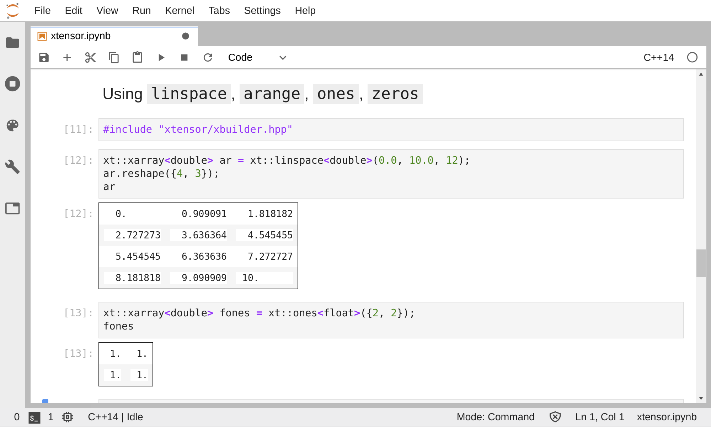

# 

[](https://travis-ci.org/QuantStack/xtensor)
[](https://ci.appveyor.com/project/QuantStack/xtensor)
[](https://dev.azure.com/johanmabille/johanmabille/_build/latest?definitionId=3&branchName=master)
[](https://scan.coverity.com/projects/xtensor)
[](https://xtensor.readthedocs.io/en/latest/?badge=latest)
[](https://mybinder.org/v2/gh/QuantStack/xtensor/stable?filepath=notebooks/xtensor.ipynb)
[](https://gitter.im/QuantStack/Lobby?utm_source=badge&utm_medium=badge&utm_campaign=pr-badge&utm_content=badge)

Multi-dimensional arrays with broadcasting and lazy computing.

## Introduction

`xtensor` is a C++ library meant for numerical analysis with multi-dimensional
array expressions.

`xtensor` provides

 - an extensible expression system enabling **lazy broadcasting**.
 - an API following the idioms of the **C++ standard library**.
 - tools to manipulate array expressions and build upon `xtensor`.

Containers of `xtensor` are inspired by [NumPy](http://www.numpy.org), the
Python array programming library. **Adaptors** for existing data structures to
be plugged into our expression system can easily be written.

In fact, `xtensor` can be used to **process NumPy data structures inplace**
using Python's [buffer protocol](https://docs.python.org/3/c-api/buffer.html).
Similarly, we can operate on Julia and R arrays. For more details on the NumPy,
Julia and R bindings, check out the [xtensor-python](https://github.com/QuantStack/xtensor-python),
[xtensor-julia](https://github.com/QuantStack/Xtensor.jl) and
[xtensor-r](https://github.com/QuantStack/xtensor-r) projects respectively.

`xtensor` requires a modern C++ compiler supporting C++14. The following C++
compilers are supported:

 - On Windows platforms, Visual C++ 2015 Update 2, or more recent
 - On Unix platforms, gcc 4.9 or a recent version of Clang

## Installation

### Package managers

If you are using Conan to manage your dependencies, merely add `xtensor/x.y.z@omaralvarez/public-conan` to your requires, where x.y.z is the release version you want to use. Please file issues in [conan-xtensor](https://github.com/omaralvarez/conan-xtensor) if you experience problems with the packages. Sample `conanfile.txt`:

```
[requires]
xtensor/0.20.8@omaralvarez/public-conan

[generators]
cmake
```

We also provide a package for the conda package manager:

```bash
conda install -c conda-forge xtensor
```

### Install from sources

`xtensor` is a header-only library.

You can directly install it from the sources:

```bash
cmake -D CMAKE_INSTALL_PREFIX=your_install_prefix
make install
```

## Trying it online

You can play with `xtensor` interactively in a Jupyter notebook right now! Just click on the binder link below:

[](https://mybinder.org/v2/gh/QuantStack/xtensor/stable?filepath=notebooks/xtensor.ipynb)

The C++ support in Jupyter is powered by the [xeus-cling](https://github.com/QuantStack/xeus-cling) C++ kernel. Together with xeus-cling, xtensor enables a similar workflow to that of NumPy with the IPython Jupyter kernel.



## Documentation

For more information on using `xtensor`, check out the reference documentation

http://xtensor.readthedocs.io/

## Dependencies

`xtensor` depends on the [xtl](https://github.com/QuantStack/xtl) library and
has an optional dependency on the [xsimd](https://github.com/QuantStack/xsimd)
library:

| `xtensor` | `xtl`   |`xsimd` (optional) |
|-----------|---------|-------------------|
|  master   | ^0.6.5  |       ^7.3.1      |
|  0.20.8   | ^0.6.4  |       ^7.2.3      |
|  0.20.7   | ^0.6.4  |       ^7.2.3      |
|  0.20.6   | ^0.6.4  |       ^7.2.3      |
|  0.20.5   | ^0.6.4  |       ^7.2.1      |
|  0.20.4   | ^0.6.2  |       ^7.0.0      |
|  0.20.3   | ^0.6.2  |       ^7.0.0      |
|  0.20.2   | ^0.6.1  |       ^7.0.0      |
|  0.20.1   | ^0.6.1  |       ^7.0.0      |
|  0.20.0   | ^0.6.1  |       ^7.0.0      |
|  0.19.4   | ^0.5.3  |       ^7.0.0      |
|  0.19.3   | ^0.5.3  |       ^7.0.0      |
|  0.19.2   | ^0.5.3  |       ^7.0.0      |
|  0.19.1   | ^0.5.1  |       ^7.0.0      |
|  0.19.0   | ^0.5.1  |       ^7.0.0      |
|  0.18.2   | ^0.4.16 |       ^7.0.0      |
|  0.18.1   | ^0.4.16 |       ^7.0.0      |
|  0.18.0   | ^0.4.16 |       ^7.0.0      |

The dependency on `xsimd` is required if you want to enable SIMD acceleration
in `xtensor`. This can be done by defining the macro `XTENSOR_USE_XSIMD`
*before* including any header of `xtensor`.

## Usage

### Basic usage

**Initialize a 2-D array and compute the sum of one of its rows and a 1-D array.**

```cpp
#include <iostream>
#include "xtensor/xarray.hpp"
#include "xtensor/xio.hpp"
#include "xtensor/xview.hpp"

xt::xarray<double> arr1
  {{1.0, 2.0, 3.0},
   {2.0, 5.0, 7.0},
   {2.0, 5.0, 7.0}};

xt::xarray<double> arr2
  {5.0, 6.0, 7.0};

xt::xarray<double> res = xt::view(arr1, 1) + arr2;

std::cout << res;
```

Outputs:

```
{7, 11, 14}
```

**Initialize a 1-D array and reshape it inplace.**

```cpp
#include <iostream>
#include "xtensor/xarray.hpp"
#include "xtensor/xio.hpp"

xt::xarray<int> arr
  {1, 2, 3, 4, 5, 6, 7, 8, 9};

arr.reshape({3, 3});

std::cout << arr;
```

Outputs:

```
{{1, 2, 3},
 {4, 5, 6},
 {7, 8, 9}}
```

**Index Access**

```cpp
#include <iostream>
#include "xtensor/xarray.hpp"
#include "xtensor/xio.hpp"

xt::xarray<double> arr1
  {{1.0, 2.0, 3.0},
   {2.0, 5.0, 7.0},
   {2.0, 5.0, 7.0}};

std::cout << arr1(0, 0) << std::endl;

xt::xarray<int> arr2
  {1, 2, 3, 4, 5, 6, 7, 8, 9};

std::cout << arr2(0);
```

Outputs:

```
1.0
1
```

### The NumPy to xtensor cheat sheet

If you are familiar with NumPy APIs, and you are interested in xtensor, you can
check out the [NumPy to xtensor cheat sheet](https://xtensor.readthedocs.io/en/latest/numpy.html)
provided in the documentation.

### Lazy broadcasting with `xtensor`

Xtensor can operate on arrays of different shapes of dimensions in an
element-wise fashion. Broadcasting rules of xtensor are similar to those of
[NumPy](http://www.numpy.org) and [libdynd](http://libdynd.org).

### Broadcasting rules

In an operation involving two arrays of different dimensions, the array with
the lesser dimensions is broadcast across the leading dimensions of the other.

For example, if `A` has shape `(2, 3)`, and `B` has shape `(4, 2, 3)`, the
result of a broadcasted operation with `A` and `B` has shape `(4, 2, 3)`.

```
   (2, 3) # A
(4, 2, 3) # B
---------
(4, 2, 3) # Result
```

The same rule holds for scalars, which are handled as 0-D expressions. If `A`
is a scalar, the equation becomes:

```
       () # A
(4, 2, 3) # B
---------
(4, 2, 3) # Result
```

If matched up dimensions of two input arrays are different, and one of them has
size `1`, it is broadcast to match the size of the other. Let's say B has the
shape `(4, 2, 1)` in the previous example, so the broadcasting happens as
follows:

```
   (2, 3) # A
(4, 2, 1) # B
---------
(4, 2, 3) # Result
```

### Universal functions, laziness and vectorization

With `xtensor`, if `x`, `y` and `z` are arrays of *broadcastable shapes*, the
return type of an expression such as `x + y * sin(z)` is **not an array**. It
is an `xexpression` object offering the same interface as an N-dimensional
array, which does not hold the result. **Values are only computed upon access
or when the expression is assigned to an xarray object**. This allows to
operate symbolically on very large arrays and only compute the result for the
indices of interest.

We provide utilities to **vectorize any scalar function** (taking multiple
scalar arguments) into a function that will perform on `xexpression`s, applying
the lazy broadcasting rules which we just described. These functions are called
*xfunction*s. They are `xtensor`'s counterpart to NumPy's universal functions.

In `xtensor`, arithmetic operations (`+`, `-`, `*`, `/`) and all special
functions are *xfunction*s.

### Iterating over `xexpression`s and broadcasting Iterators

All `xexpression`s offer two sets of functions to retrieve iterator pairs (and
their `const` counterpart).

 - `begin()` and `end()` provide instances of `xiterator`s which can be used to
   iterate over all the elements of the expression. The order in which
   elements are listed is `row-major` in that the index of last dimension is
   incremented first.
 - `begin(shape)` and `end(shape)` are similar but take a *broadcasting shape*
   as an argument. Elements are iterated upon in a row-major way, but certain
   dimensions are repeated to match the provided shape as per the rules
   described above. For an expression `e`, `e.begin(e.shape())` and `e.begin()`
   are equivalent.

### Runtime vs compile-time dimensionality

Two container classes implementing multi-dimensional arrays are provided:
`xarray` and `xtensor`.

 - `xarray` can be reshaped dynamically to any number of dimensions. It is the
   container that is the most similar to NumPy arrays.
 - `xtensor` has a dimension set at compilation time, which enables many
   optimizations. For example, shapes and strides of `xtensor` instances are
   allocated on the stack instead of the heap.

`xarray` and `xtensor` container are both `xexpression`s and can be involved
and mixed in universal functions, assigned to each other etc...

Besides, two access operators are provided:

 - The variadic template `operator()` which can take multiple integral
   arguments or none.
 - And the `operator[]` which takes a single multi-index argument, which can be
   of size determined at runtime. `operator[]` also supports access with braced
   initializers.

## Performances

Xtensor operations make use of SIMD acceleration depending on what instruction
sets are available on the platform at hand (SSE, AVX, AVX512, Neon).

### [](https://github.com/QuantStack/xsimd)

The [xsimd](https://github.com/QuantStack/xsimd) project underlies the
detection of the available instruction sets, and provides generic high-level
wrappers and memory allocators for client libraries such as xtensor.

### Continuous benchmarking

Xtensor operations are continuously benchmarked, and are significantly improved
at each new version. Current performances on statically dimensioned tensors
match those of the Eigen library. Dynamically dimension tensors for which the
shape is heap allocated come at a small additional cost.

### Stack allocation for shapes and strides

More generally, the library implement a `promote_shape` mechanism at build time
to determine the optimal sequence type to hold the shape of an expression. The
shape type of a broadcasting expression whose members have a dimensionality
determined at compile time will have a stack allocated sequence type. If at
least one note of a broadcasting expression has a dynamic dimension
(for example an `xarray`), it bubbles up to the entire broadcasting expression
which will have a heap allocated shape. The same hold for views, broadcast
expressions, etc...

Therefore, when building an application with xtensor, we recommend using
statically-dimensioned containers whenever possible to improve the overall
performance of the application.

## Language bindings

### [](https://github.com/QuantStack/xtensor-python)

The [xtensor-python](https://github.com/QuantStack/xtensor-python) project
provides the implementation of two `xtensor` containers, `pyarray` and
`pytensor` which effectively wrap NumPy arrays, allowing inplace modification,
including reshapes.

Utilities to automatically generate NumPy-style universal functions, exposed to
Python from scalar functions are also provided.

### [](https://github.com/QuantStack/xtensor-julia)

The [xtensor-julia](https://github.com/QuantStack/xtensor-julia) project
provides the implementation of two `xtensor` containers, `jlarray` and
`jltensor` which effectively wrap julia arrays, allowing inplace modification,
including reshapes.

Like in the Python case, utilities to generate NumPy-style universal functions
are provided.

### [](https://github.com/QuantStack/xtensor-r)

The [xtensor-r](https://github.com/QuantStack/xtensor-r) project provides the
implementation of two `xtensor` containers, `rarray` and `rtensor` which
effectively wrap R arrays, allowing inplace modification, including reshapes.

Like for the Python and Julia bindings, utilities to generate NumPy-style
universal functions are provided.

## Library bindings

### [](https://github.com/QuantStack/xtensor-blas)

The [xtensor-blas](https://github.com/QuantStack/xtensor-blas) project provides
bindings to BLAS libraries, enabling linear-algebra operations on xtensor
expressions.

### [](https://github.com/QuantStack/xtensor-io)

The [xtensor-io](https://github.com/QuantStack/xtensor-io) project enables the
loading of a variety of file formats into xtensor expressions, such as image
files, sound files, HDF5 files, as well as NumPy npy and npz files.

## Building and running the tests

Building the tests requires the [GTest](https://github.com/google/googletest)
testing framework and [cmake](https://cmake.org).

gtest and cmake are available as packages for most Linux distributions.
Besides, they can also be installed with the `conda` package manager (even on
windows):

```bash
conda install -c conda-forge gtest cmake
```

Once `gtest` and `cmake` are installed, you can build and run the tests:

```bash
mkdir build
cd build
cmake -DBUILD_TESTS=ON ../
make xtest
```

You can also use CMake to download the source of `gtest`, build it, and use the
generated libraries:

```bash
mkdir build
cd build
cmake -DBUILD_TESTS=ON -DDOWNLOAD_GTEST=ON ../
make xtest
```

## Building the HTML documentation

xtensor's documentation is built with three tools

 - [doxygen](http://www.doxygen.org)
 - [sphinx](http://www.sphinx-doc.org)
 - [breathe](https://breathe.readthedocs.io)

While doxygen must be installed separately, you can install breathe by typing

```bash
pip install breathe sphinx_rtd_theme
```

Breathe can also be installed with `conda`

```bash
conda install -c conda-forge breathe
```

Finally, go to `docs` subdirectory and build the documentation with the
following command:

```bash
make html
```

## License

We use a shared copyright model that enables all contributors to maintain the
copyright on their contributions.

This software is licensed under the BSD-3-Clause license. See the
[LICENSE](LICENSE) file for details.
